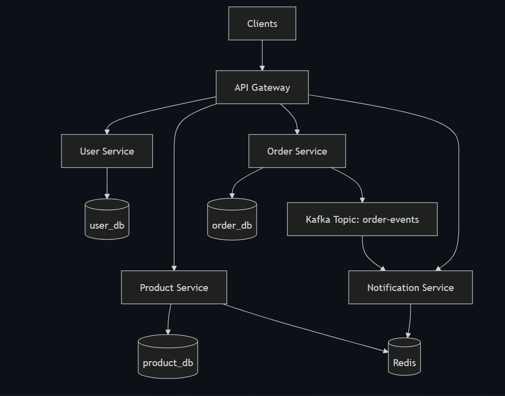
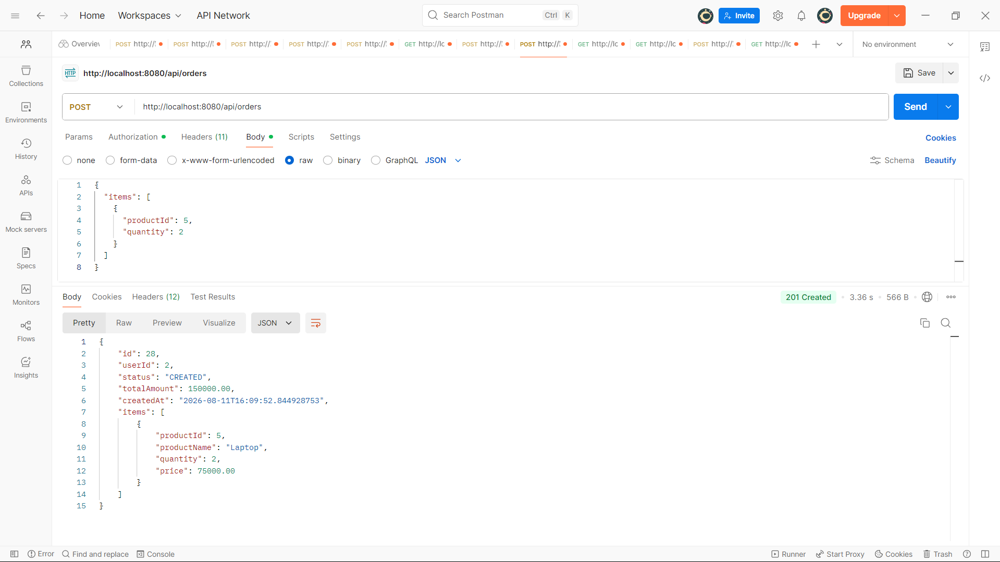
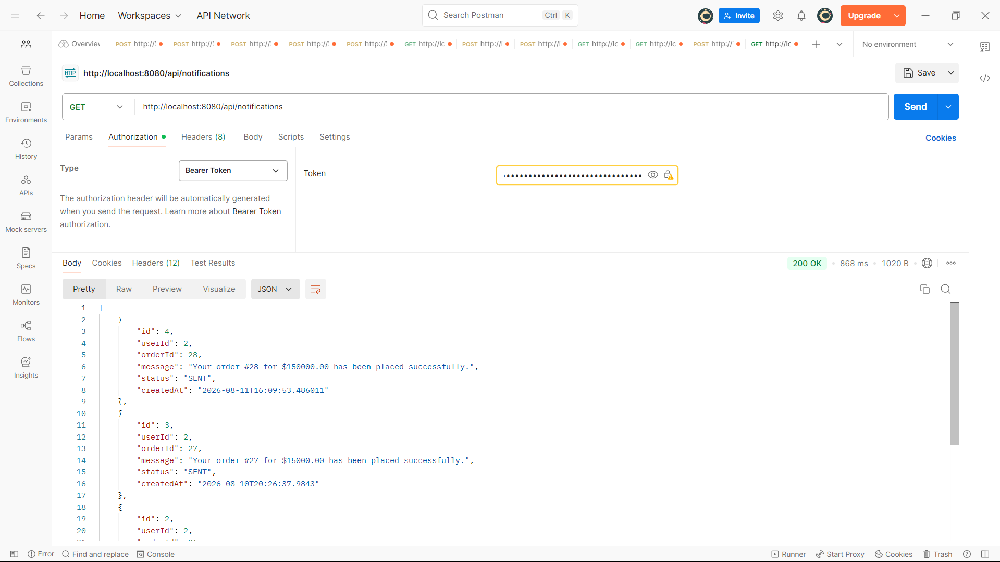
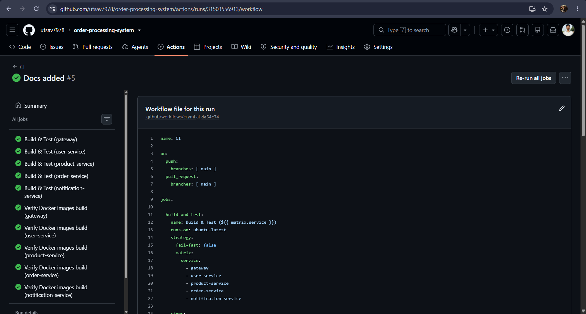

# Order Processing System

A containerized microservices-based order processing system built with Spring Boot. The system separates user, product, order, and notification responsibilities into independent services and uses an API Gateway as the single entry point.

The project demonstrates synchronous inter-service communication using OpenFeign, asynchronous event-driven communication using Apache Kafka, Redis-based caching, independent MySQL databases, Docker-based deployment, and GitHub Actions CI.

---

## Architecture

The system consists of five Spring Boot services:

- **API Gateway** – Single entry point for client requests and request routing
- **User Service** – User management and authentication
- **Product Service** – Product and inventory management
- **Order Service** – Order creation and order retrieval
- **Notification Service** – Processes order events and creates notifications

Supporting infrastructure:

- **MySQL** – Separate databases for the User, Product, Order services, and Notification services
- **Redis** – Caching layer used by the Product Service
- **Apache Kafka** – Asynchronous event communication between Order Service and Notification Service
- **Zookeeper** – Kafka coordination
- **Docker Compose** – Container orchestration

### System Architecture



---

## Technology Stack

| Technology | Purpose |
|---|---|
| Java 21 | Application development |
| Spring Boot | Microservices development |
| Spring Cloud Gateway | API Gateway and routing |
| Spring Cloud OpenFeign | Synchronous service-to-service communication |
| Spring Data JPA / Hibernate | ORM and database access |
| MySQL 8 | Persistent storage |
| Apache Kafka | Asynchronous event-driven communication |
| Redis | Caching |
| Docker | Containerization |
| Docker Compose | Multi-container orchestration |
| Maven | Dependency management and builds |
| GitHub Actions | Continuous Integration |
| JWT | Authentication and authorization |

---

## Microservices

### API Gateway

The API Gateway acts as the entry point for external clients.

Responsibilities:

- Routes requests to the appropriate microservice
- Provides a single endpoint for clients
- Handles gateway-level request processing

Default port: `8080`

### User Service

Handles user-related functionality.

Responsibilities:

- User registration
- User authentication
- User-related data management
- JWT-based authentication

Default port: `8081`

Database: `user_db`

### Product Service

Handles product and inventory operations.

Responsibilities:

- Create products
- Retrieve products
- Update products
- Delete products
- Product lookup by ID
- Inventory information

The service uses Redis as a caching layer.

> Note: Product `getById` caching is currently disabled (`@Cacheable` is commented out). Redis remains part of the service architecture and is configured for caching functionality.

Default port: `8082`

Database: `product_db`

### Order Service

Handles order creation and retrieval.

Responsibilities:

- Create orders
- Retrieve orders for a user
- Retrieve an individual order
- Validate requested products through Product Service
- Calculate order totals
- Persist orders and order items
- Publish `OrderCreatedEvent` events to Kafka
- Maintain recent-order cache functionality

Default port: `8083`

Database: `order_db`

### Notification Service

Consumes order creation events from Kafka and creates notifications.

Responsibilities:

- Consume `OrderCreatedEvent`
- Process order notification data
- Store generated notifications
- Expose notification retrieval APIs

Default port: `8084`

Database: `notification_db`

---

## Service Communication

The system uses two communication patterns.

### Synchronous Communication

The Order Service communicates with the Product Service using OpenFeign.

```text
Client
   |
   v
API Gateway
   |
   v
Order Service
   |
   | OpenFeign
   v
Product Service
```

When an order is created, the Order Service retrieves product information using the product ID and validates stock availability before saving the order.

### Asynchronous Communication

Order creation events are published using Apache Kafka.

```text
Order Service
      |
      | OrderCreatedEvent
      v
Kafka: order-events
      |
      v
Notification Service
      |
      v
Notification
```

This keeps notification processing decoupled from the Order Service.

Detailed Kafka documentation: [`docs/kafka-flow.md`](docs/kafka-flow.md)

---

## Data Storage

Each service with persistent relational data maintains its own database.

```text
User Service           → user_db
Product Service        → product_db
Order Service          → order_db
Notification Service   → notification_db
```

This follows the database-per-service approach and keeps service data isolated.

The Order Service stores both orders and their associated order items.

---

## Redis

Redis is used as the caching layer for the Product Service.

The project includes Redis configuration and caching support to reduce unnecessary database access for frequently requested product data.

Detailed Redis documentation: [`docs/redis-usage.md`](docs/redis-usage.md)

---

## Order Creation Flow

A typical order creation request follows this flow:

```text
Client
  |
  v
API Gateway
  |
  v
Order Service
  |
  |-- OpenFeign --> Product Service
  |                    |
  |                    v
  |                 Product DB
  |
  | Validate stock
  |
  v
Order DB
  |
  | Publish OrderCreatedEvent
  v
Kafka
  |
  v
Notification Service
  |
  v
Notification
```

The Order Service:

1. Receives the order request.
2. Retrieves the requested product information.
3. Validates product availability and stock.
4. Calculates the total order amount.
5. Saves the order and order items in `order_db`.
6. Publishes an `OrderCreatedEvent` to Kafka.
7. The Notification Service consumes the event and creates a notification.

---

## API Overview

All external requests are routed through the API Gateway.

Base URL:

```text
http://localhost:8080
```

### User APIs

```text
/api/users/...
```

Used for user registration and authentication.

### Product APIs

```text
/api/products/...
```

Used for product management and retrieval.

### Order APIs

```text
POST /api/orders
GET  /api/orders
GET  /api/orders/{id}
```

### Notification APIs

```text
GET /api/notifications
```

Authentication is handled using JWT Bearer tokens for protected endpoints.

---

## Example: Create Order

### Request

```http
POST http://localhost:8080/api/orders
```

Example request body:

```json
{
  "items": [
    {
      "productId": 5,
      "quantity": 2
    }
  ]
}
```

### Successful Response

`201 Created`

Example:

```json
{
  "id": 28,
  "userId": 2,
  "status": "CREATED",
  "totalAmount": 150000.00,
  "createdAt": "2026-08-11T16:09:52.844928753",
  "items": [
    {
      "productId": 5,
      "productName": "Laptop",
      "quantity": 2,
      "price": 75000.00
    }
  ]
}
```

### Order Creation Screenshot



---

## Notification Processing

After an order is successfully created, the Order Service publishes an event to the Kafka topic:

```text
order-events
```

The Notification Service consumes this event and creates a notification.

Example notification retrieval:

```http
GET http://localhost:8080/api/notifications
```

### Notification Screenshot



---

## Docker Setup

The complete application can be run using Docker Compose.

The Docker environment contains:

- API Gateway
- User Service
- Product Service
- Order Service
- Notification Service
- MySQL
- Redis
- Kafka
- Zookeeper

### Prerequisites

- Docker Desktop
- Git

### Start the System

```bash
docker compose up -d
```

### Check Running Containers

```bash
docker ps
```

### Stop the System

```bash
docker compose down
```

### Rebuild After Code Changes

```bash
docker compose up -d --build
```

### View Service Logs

```bash
docker logs order-service
```

or:

```bash
docker logs notification-service
```

---

## Kafka

Kafka is used for asynchronous communication between the Order Service and Notification Service.

Main topic:

```text
order-events
```

The Order Service publishes `OrderCreatedEvent` messages and the Notification Service consumes them.

Kafka-related documentation: [`docs/kafka-flow.md`](docs/kafka-flow.md)

---

## Project Structure

```text
order-processing-system/
│
├── .github/
│   └── workflows/
│       └── ci.yml
│
├── docs/
│   ├── architecture.md
│   ├── interview-questions.md
│   ├── kafka-flow.md
│   └── redis-usage.md
│
├── screenshots/
│   ├── architecture.png
│   ├── order-created.png
│   ├── notifications.png
│   └── github-actions.png
│
├── gateway/
├── user-service/
├── product-service/
├── order-service/
├── notification-service/
│
├── docker-compose.yml
├── .gitignore
└── README.md
```

Each microservice is independently structured with its own source code, configuration, dependencies, Dockerfile, and build configuration.

---

## CI

The project uses GitHub Actions for continuous integration.

The workflow runs on pushes and pull requests targeting the `main` branch.

The CI pipeline:

- Builds and tests all five services
- Verifies Docker image builds for all five services

The workflow covers:

```text
gateway
user-service
product-service
order-service
notification-service
```

### CI Pipeline



---

## Documentation

Additional technical documentation is available in the `docs` directory:

- [`architecture.md`](docs/architecture.md) – Architecture documentation
- [`kafka-flow.md`](docs/kafka-flow.md) – Kafka event flow
- [`redis-usage.md`](docs/redis-usage.md) – Redis and caching
- [`interview-questions.md`](docs/interview-questions.md) – Project-related interview preparation

---

## Configuration

Service configuration is maintained in each service's Spring configuration files.

Docker-specific configuration is provided through:

```text
application-docker.yml
```

Environment-specific values should be configured through environment variables or Docker Compose configuration rather than hardcoding credentials.

---

## Running the Complete System

Clone the repository:

```bash
git clone https://github.com/utsav7978/order-processing-system.git
cd order-processing-system
```

Start all services:

```bash
docker compose up -d --build
```

Verify the containers:

```bash
docker ps
```

The API Gateway will be available at:

```text
http://localhost:8080
```

All client requests should be made through the API Gateway rather than directly accessing the individual microservices.

---

## Author

**Utsav Kumar Singh**  
B.Tech Computer Science and Engineering  
VIT-AP University

- GitHub: [@utsav7978](https://github.com/utsav7978)
- LinkedIn: [Utsav Kumar Singh](https://www.linkedin.com/)
