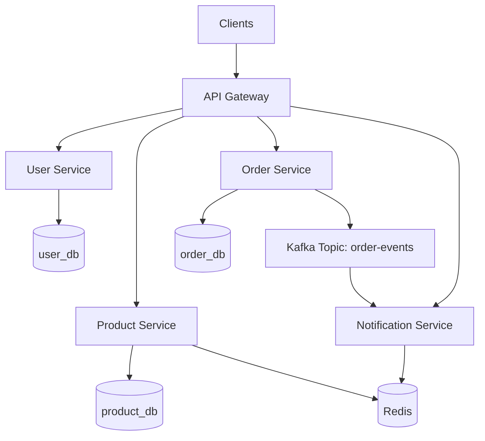

# Architecture

```mermaid
graph TD
    A[Clients] --> B[API Gateway]
    B --> C[User Service]
    B --> D[Product Service]
    B --> E[Order Service]
    B --> F[Notification Service]

    C --> G[(user_db)]
    D --> H[(product_db)]
    E --> I[(order_db)]

    E --> J[Kafka Topic: order-events]
    J --> F

    D --> K[(Redis)]
    F --> K
```